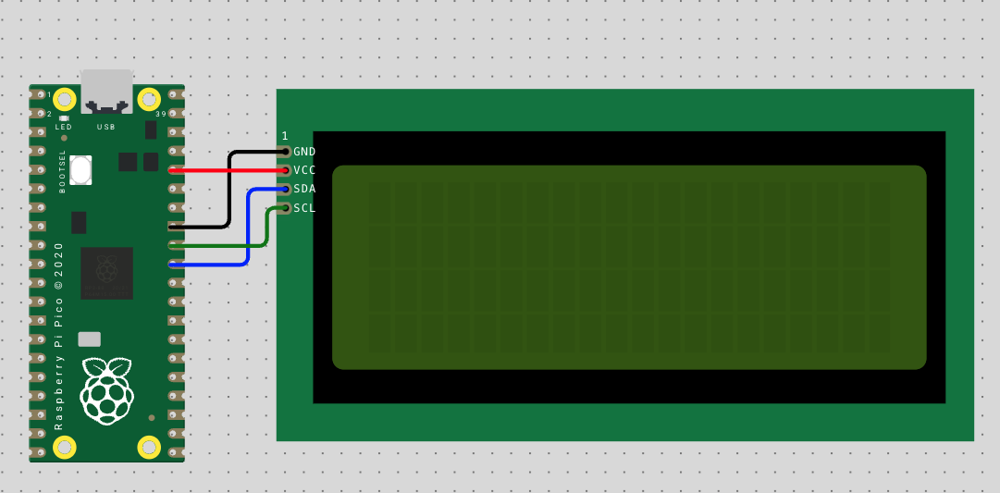

# LCD

Hiển thị text lên màn hình **LCD 20×4** qua giao tiếp **I2C** sử dụng module backpack **PCF8574**.

## Phần cứng

| Linh kiện | Số lượng |
|---|---|
| Raspberry Pi Pico 2 | 1 |
| LCD 20×4 (HD44780) + module I2C PCF8574 | 1 |
| Dây jumper | 4 |

## Sơ đồ nối dây



| Pico 2 | PCF8574 (LCD) |
|---|---|
| GP26 — Pin 31 | SDA |
| GP27 — Pin 32 | SCL |
| 3V3 — Pin 36 | VCC |
| GND — Pin 33 | GND |


## Nguyên lý hoạt động

LCD HD44780 giao tiếp theo chuẩn parallel 4-bit/8-bit, cần nhiều chân GPIO. Module **PCF8574** là bộ mở rộng I/O qua I2C — chuyển đổi 2 dây I2C (SDA/SCL) thành 8 chân GPIO để điều khiển LCD, giúp tiết kiệm chân Pico.

Pico giao tiếp với PCF8574 qua **I2C bus 1** tốc độ 400 kHz. PCF8574 điều khiển các đường data (D4–D7), RS, EN và backlight của LCD ở chế độ **4-bit**.

Địa chỉ I2C mặc định của module là **0x27** (hoặc 0x3F tùy phiên bản).
```
i2c = I2C(1, sda=Pin(26), scl=Pin(27), freq=400000)
lcd = I2cLcd(i2c, 0x27, 4, 20)
```
# Hiển thị text
```
lcd.putstr("Xin chao!")
```

# Di chuyển con trỏ đến hàng 2, cột 0
```lcd.move_to(0, 1)
lcd.putstr("Raspberry Pi Pico")
```
# Tắt/bật đèn nền
```
lcd.backlight_off()
lcd.backlight_on()
```
# Xóa màn hình
```
lcd.clear()
```
