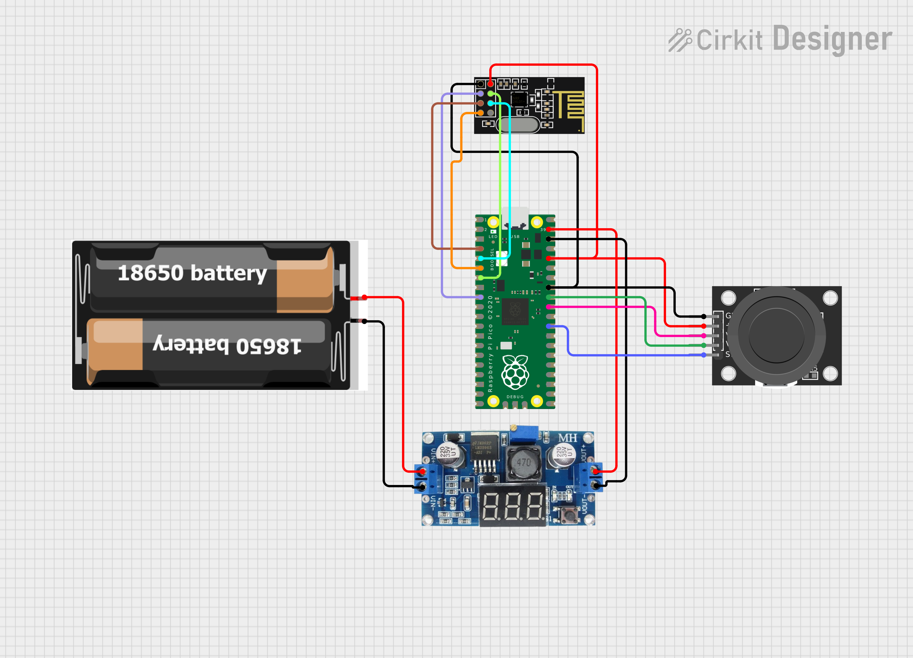

# Mecanum Controller

Tay cầm điều khiển không dây: đọc joystick 2 trục, nhận diện 8 hướng và truyền lệnh qua **NRF24L01** đến robot mecanum.

## Phần cứng

| Linh kiện | Số lượng |
|---|---|
| Raspberry Pi Pico 2 | 1 |
| Joystick module (2 trục analog + button) | 1 |
| Module NRF24L01 | 1 |
| Dây jumper | - |

## Sơ đồ nối dây



**Joystick → Pico 2**

| Joystick | Pico 2 |
|---|---|
| VCC | 3V3 |
| GND | GND |
| VRX | GP26 |
| VRY | GP27 |
| SW | GP22 |

**NRF24L01 → Pico 2**

| NRF24L01 | Pico 2 |
|---|---|
| VCC | 3V3 |
| GND | GND |
| CE | GP6 |
| CSN | GP5 |
| SCK | GP2 |
| MOSI | GP3 |
| MISO | GP4 |

> Cả Joystick lẫn NRF24L01 đều chỉ dùng **3.3V**, không dùng 5V.

## Nguyên lý hoạt động

Joystick 2 trục xuất tín hiệu analog (0–65535) trên 2 chân ADC. Pico đọc tín hiệu, áp dụng **deadzone** quanh tâm để lọc nhiễu, rồi phân loại thành 9 trạng thái: CENTER + 8 hướng.

Mỗi 5ms, một packet **2 byte** được gửi qua NRF24L01 (SPI0, channel 46):

```
byte[0] = hướng (0 = center, 1–8 = 8 hướng)
byte[1] = nút SW (0 = nhả, 1 = bấm)
```

| byte[0] | Hướng |
|---|---|
| 0 | CENTER |
| 1 | UP |
| 2 | DOWN |
| 3 | LEFT |
| 4 | RIGHT |
| 5 | UP-LEFT |
| 6 | UP-RIGHT |
| 7 | DOWN-LEFT |
| 8 | DOWN-RIGHT |
